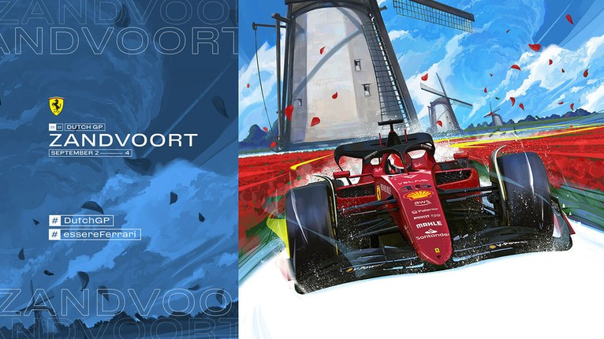

<!-- ABOUT THE PROJECT -->
# Ferrari F1 Artwork Scraper

This script will scrape F1 Cover Art images from Ferrari's F1 website. These artworks are created to promote each race weekend.

<!-- PROJECT LOGO -->
<br />
<div align="center">
  <a href="https://github.com/othneildrew/Best-README-Template">
    
  </a>
  
</div>

More Info:
* Scrapes artwork from the following seasons: 2019, 2020, 2021, 2022.
* Includes portrait and landscape artwork for each race weekend.
* Portrait images are 830x804 resolution.
* Landscapre images are 766x430 resolution. 

TO DO LIST:
1. Allow custom filename output
2. Create smarter default filenames (parse race name out of url)
3. Get full size images
4. Remove white background from portrait images.

<!-- GETTING STARTED -->
## Getting Started
Download requirements.txt and FerrariImageScraper.py

### Prerequisites

Install Requirements
* pip
  ```sh
  pip install -r requirements.txt
  ```

Alternative method for installing beautifulsoup if requirements.txt has an issue:
* pip
  ```sh
  pip install bs4
  ```

<!-- USAGE EXAMPLES -->
## Usage

Images will be saved to the same directory as the script by deafult. 
A relative or absolute filepath can be passed as a parameter to specify the output directory. 

Same directory as script:
  ```sh
  python FerrariImageScraper.py
  ```

Save to a specified directory using a relative filepath:
  ```sh
  python FerrariImageScraper.py output/
  ```

Save to a specified directory using a relative filepath:
  ```sh
  python FerrariImageScraper.py C:\Users\test\Downloads\
  ```

<!-- Disclaimer-->
## Disclaimer

I do not own these images. These images are used for educational purposes under Fair Use Copyright laws.


